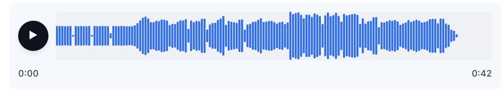
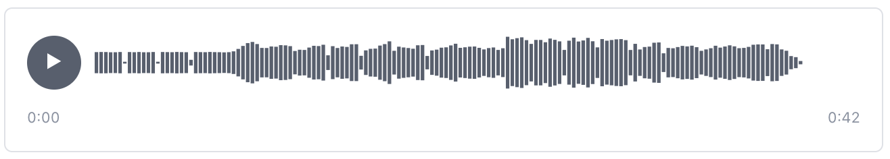
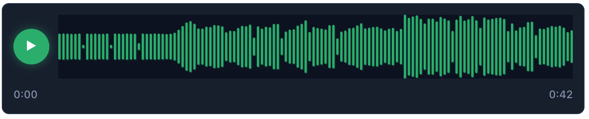
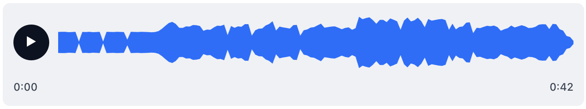
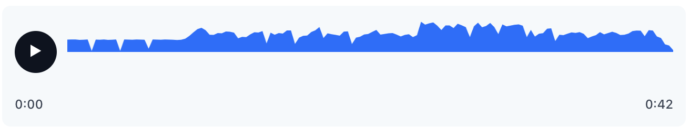

# Voice Doon - WordPress Audio Player Plugin

A lightweight, modern audio player with a canvas waveform for WordPress. No external libraries. Fast, clean, and customizable with Persian/Farsi support.

## Features

- 🎵 **Canvas-based Waveform**: Beautiful waveforms rendered using HTML5 Canvas
- 🚀 **Lightweight**: No jQuery or external dependencies
- 🎨 **5 Design Presets**: Modern, Minimal, Neon, Wave, Wave Top
- ⚙️ **Highly Customizable**: Colors, sizes, button position, wave styles
- 🌍 **Multilingual**: Persian/Farsi translations included
- 📱 **Responsive**: Works on all devices
- 🔒 **Privacy-friendly**: No third-party calls
- 📝 **Shortcode Support**: Works in posts, pages, and widgets
- 🧱 **Gutenberg Ready**: Block editor integration
- ✏️ **TinyMCE Button**: Classic editor support

## Screenshots

### Design Presets Preview

<table>
<tr>
<td width="50%">


*Modern preset - Clean bars with subtle shadows*

</td>
<td width="50%">


*Minimal preset - Thin lines with elegant spacing*

</td>
</tr>
<tr>
<td width="50%">


*Neon preset - Glowing bars with dark theme*

</td>
<td width="50%">


*Wave preset - Continuous filled waveform*

</td>
</tr>
<tr>
<td width="50%">


*Wave Top preset - Only upper half of waveform*

</td>
<td width="50%">

*Maybe More in near future*

</td>
</tr>
</table>

### Player & Settings

<table>
<tr>
<td width="50%">


*Voice Doon player with custom colors and settings*

</td>
<td width="50%">


*Admin settings page with all customization options*

</td>
</tr>
</table>

### Block Editor Integration

*Voice Doon block in the WordPress block editor*


## Installation

1. Upload the plugin folder to `/wp-content/plugins/`
2. Activate "Voice Doon" from Plugins in WordPress
3. Go to Settings → Voice Doon to configure defaults
4. Add the shortcode to a post or page

## Usage

### Basic Shortcode
```
[podcast_player src="https://example.com/audio.mp3"]
```

### Advanced Shortcode
```
[podcast_player 
    src="https://example.com/audio.mp3" 
    title="Episode 1" 
    preset="wave" 
    button_position="inside" 
    accent="#3b82f6" 
    bg="#f3f4f6" 
    progress="#111827"
    height="64"
    radius="2"
    wave_style="continuous"
    load_on="view"
    preload="metadata"
]
```

### Available Attributes

| Attribute | Description | Options | Default |
|-----------|-------------|---------|---------|
| `src` | Audio file URL (required) | Any valid URL | - |
| `title` | Optional title label | Any text | - |
| `preset` | Design preset | modern, minimal, neon, wave, wave_top | modern |
| `wave_style` | Wave style | bars, line, continuous | bars |
| `button_position` | Button position | inside, outside | outside |
| `accent` | Wave bar color | Hex color | #3b82f6 |
| `progress` | Played overlay color | Hex color | #111827 |
| `bg` | Canvas background color | Hex color | #f3f4f6 |
| `height` | Canvas height | Pixels | 64 |
| `radius` | Bar radius | Pixels | 2 |
| `preload` | Audio preload | none, metadata, auto | none |
| `load_on` | When to load audio | view, click | view |

## Design Presets

### Modern (Default)
Clean bars with subtle shadows
- Colors: Blue accent, light gray background, dark progress
- Height: 64px, Radius: 2px

### Minimal
Thin lines with elegant spacing
- Colors: Gray accent, white background, dark progress
- Height: 48px, Radius: 0px

### Neon
Glowing bars with dark theme
- Colors: Green accent, dark background, yellow progress
- Height: 72px, Radius: 4px

### Wave
Continuous filled waveform
- Colors: Blue accent, light gray background, dark progress
- Height: 64px, Radius: 0px

### Wave Top
Only upper half of waveform
- Colors: Blue accent, very light gray background, dark progress
- Height: 64px, Radius: 0px

## Development

### WordPress Coding Standards

This plugin follows WordPress Coding Standards (WPCS). To check compliance:

```bash
# Install tools
composer global require squizlabs/php_codesniffer wp-coding-standards/wpcs

# Configure PHPCS
~/.composer/vendor/bin/phpcs --config-set installed_paths ~/.composer/vendor/wpcs

# Run checks
~/.composer/vendor/bin/phpcs --standard=phpcs.xml.dist /path/to/voicedoon
```

### File Structure

```
voicedoon/
├── voicedoon.php              # Main plugin file
├── assets/
│   ├── css/
│   │   ├── player.css         # Player styles
│   │   └── admin.css          # Admin styles
│   ├── js/
│   │   ├── player.js          # Player functionality
│   │   ├── block.js           # Gutenberg block
│   │   └── admin.js           # Admin functionality
│   └── tinymce-wbdn-voice.js  # TinyMCE integration
├── languages/
│   ├── voicedoon-fa_IR.po     # Persian translations
│   └── voicedoon-fa_IR.mo     # Compiled translations
├── phpcs.xml.dist             # WPCS configuration
├── readme.txt                 # WordPress.org readme
├── README.md                  # This file
└── .gitignore                 # Git ignore rules
```

## Browser Support

- Chrome 60+
- Firefox 55+
- Safari 12+
- Edge 79+

## License

GPLv2 or later - https://www.gnu.org/licenses/gpl-2.0.html

## Author

**Barmaan Shokoohi**  
WebDoon - https://webdoon.ir

## Changelog

### 1.0.0
- Initial release
- Canvas-based waveform rendering
- 5 design presets
- 3 wave styles
- Customizable colors and dimensions
- Shortcode support
- Gutenberg block integration
- TinyMCE button
- Persian/Farsi translations
- WordPress Coding Standards compliance
- No external dependencies

## Contributing

This plugin is developed by WebDoon. For issues and contributions, please visit our website at https://webdoon.ir

## Support

For support and questions, please visit our website or create an issue in the repository.
